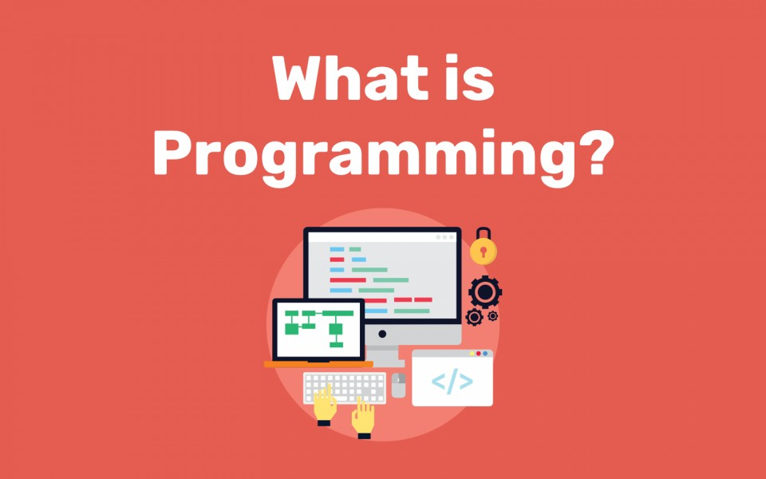

# Learning-Resources
Curated List of Learning Resources for the benefit of everyone. Feel free to make a PR if you wanna add something.

Learning Resources

- All the resources are free, you just need to devote your time. 
- A lot of these courses are multiple hours long, so it is recommended to watch them in multiple sittings of 30-45 minutes each.
- Making Projects is more important than certifications.

  

<h3>Complete Beginners with no prior experience in coding:</h3>

- Harvard CS50 (Intro to Computer Science)- <https://youtube.com/playlist?list=PLWKjhJtqVAbmGw5fN5BQlwuug-8bDmabi>

- MIT 6.001 (intro to Computer Science in Python):-

<https://ocw.mit.edu/courses/electrical-engineering-and-computer-science/6-0001-introduction-to-computer-science-and-programming-in-python-fall-2016/lecture-videos/index.htm>

  

<h3>Mathematics for Computer Science:</h3>

- MIT 6.042( Mathematics for Computer Science):-

<https://youtube.com/playlist?list=PLB7540DEDD482705B>

  

<h3>C++ , Java and Python for beginners:</h3>
- C++:

- FreeCodeCamp (recommended):

<https://youtu.be/vLnPwxZdW4Y>

- CodeWithHarry:

<https://youtube.com/playlist?list=PLu0W_9lII9agpFUAlPFe_VNSlXW5uE0YL>

- Java :

- FreeCodeCamp (recommended):

<https://youtu.be/grEKMHGYyns>

- ProgrammingWithMosh :

<https://youtu.be/eIrMbAQSU34>

- Simplilearn:

<https://youtu.be/CFD9EFcNZTQ>

- Python:

**Note**- Python is not recommended to pick up as a first language because it has a lot of abstraction, however python is easy to pick-up and has a lot of uses ranging from web-development to Data Science.

- FreeCodeCamp:

<https://youtu.be/rfscVS0vtbw>

- CodeWithHarry:-

<https://youtu.be/gfDE2a7MKjA>

- Programming With Mosh:

<https://youtu.be/_uQrJ0TkZlc>

  

<h3>Data Structures and Algorithms:-</h3>

- MIT 6.006 (Introduction to Algorithms) :-

**Note**- This course will be beneficial for people who are comfortable with the implementation of various Data structures, fairly rigorous and theoretical.

<https://youtube.com/playlist?list=PLUl4u3cNGP61Oq3tWYp6V_F-5jb5L2iHb>

- Apna College C++ DSA Playlist ( Recommended) :-

<https://youtube.com/playlist?list=PLfqMhTWNBTe0b2nM6JHVCnAkhQRGiZMSJ>

- Community Classroom DSA (in Java) (Recommended) :- 

Coming soon (starts from 1st Aug 2021) 

Follow-<https://www.youtube.com/channel/UCBGOUQHNNtNGcGzVq5rIXjw>

- CodeWithHarry DSA (in Hindi):-

<https://youtube.com/playlist?list=PLu0W_9lII9ahIappRPN0MCAgtOu3lQjQi>

- Anuj bhaiya DSA ( in Java):

<https://www.youtube.com/playlist?list=PLUcsbZa0qzu3yNzzAxgvSgRobdUUJvz7p>

  

 <h3>Web development :-</h3>

- Web Dev Simplified (Intro):

<https://youtube.com/playlist?list=PLZlA0Gpn_vH-cEDOofOujFIknfZZpIk3a>

- CodeWithHarry WebDev Playlist( in Hindi):

<https://youtube.com/playlist?list=PLu0W_9lII9agiCUZYRsvtGTXdxkzPyItg>

- Dr. Joshua Bastaen WebDev Playlist( in Eng):

<https://youtube.com/playlist?list=PLQSmIhc0GVPPhpBAC3y6xChtOz3RJ8abN>

- NewBoston Django Course :

<https://youtube.com/playlist?list=PL6gx4Cwl9DGBlmzzFcLgDhKTTfNLfX1IK>

  

 
 <h3>Android development:-></h3>

- CodeWithHarry (in Hindi):

<https://youtu.be/mXjZQX3UzOs>

- Android Developer:-

<https://youtube.com/playlist?list=PLknSwrodgQ72X4sKpzf5vT8kY80HKcUSe>

- Kotlin basics tutorial:

<https://www.youtube.com/watch?v=mnkzx3TwbV8>

- Android development for beginners:

<https://www.youtube.com/watch?v=BBWyXo-3JGQ>

- Other resources:

<https://www.youtube.com/watch?v=Iz08OTTjR04>

<https://www.youtube.com/watch?v=uRyvNKRkwbs>

- Anuj Bhaiya’s Course ( in Kotlin):-

<https://youtube.com/playlist?list=PLUcsbZa0qzu3Mri2tL1FzZy-5SX75UJfb>

  

<h3>Data Science/ Machine Learning :-</h3>

- CodeBasics ( in Python , with basics of python included):-

<https://youtube.com/playlist?list=PLeo1K3hjS3us_ELKYSj_Fth2tIEkdKXvV>

- FreeCodeCamp (Data Analysis):-

<https://youtu.be/r-uOLxNrNk8>

- Statistics For Data Science ( by Dr. Sarkar PhD , Stanford University):-

<https://youtu.be/Vfo5le26IhY>

- Sentdex (Machine learning with python):-

<https://youtube.com/playlist?list=PLQVvvaa0QuDfKTOs3Keq_kaG2P55YRn5v>

- Code For Cause (ML bootcamp):-

<https://www.youtube.com/playlist?list=PLyzHIYrZBplo3K0dNUqppd2ynnoZPD6N1>

- Kaggle resources:-

Note- Follow along written tutorials with hands-on implementation of code

<https://www.kaggle.com/learn>

  

<h3>Some Popular Youtube Channels to follow :</h3>

- Code with Harry (Web,Android,Languages)-<https://www.youtube.com/channel/UCeVMnSShP_Iviwkknt83cww>

- New Boston(Web,Dev-ops)- <https://www.youtube.com/user/thenewboston>

- Web Dev Simplified(Web)-<https://www.youtube.com/channel/UCFbNIlppjAuEX4znoulh0Cw>

- Computerphile(Theoretical CS, Important topics)- <https://www.youtube.com/user/Computerphile>

- Kunal Khushwaha (Devops,Open-source,Web)- <https://www.youtube.com/channel/UCBGOUQHNNtNGcGzVq5rIXjw>

- Anuj Bhaiya(Android)- <https://www.youtube.com/channel/UC58_wzhvJta3hDSPvRLDAqg>

- Dapp University(Blockchain)- <https://www.youtube.com/channel/UCY0xL8V6NzzFcwzHCgB8orQ>

- MIT Open Courseware (get MIT lectures for free)- <https://www.youtube.com/user/MIT>

- Simplilearn(All)- <https://www.youtube.com/user/Simplilearn>

- Edureka(All)- <https://www.youtube.com/user/edurekaIN>

- TraversyMedia(Web)- <https://www.youtube.com/c/TraversyMedia/featured>

- Sentdex(Machine learning)- <https://www.youtube.com/c/sentdex>

- Krish Naik(Machine learning)- <https://www.youtube.com/user/krishnaik06>

- Ken Jee(Data Science, Sports Analytics)- <https://www.youtube.com/channel/UCiT9RITQ9PW6BhXK0y2jaeg>

- Code For Cause(open source, web, ML)- <https://www.youtube.com/c/CodeforCause>

- Fireship ( Firebase, for Android)- <https://www.youtube.com/channel/UCsBjURrPoezykLs9EqgamOA>

- Apna College- <https://www.youtube.com/channel/UCBwmMxybNva6P_5VmxjzwqA>
